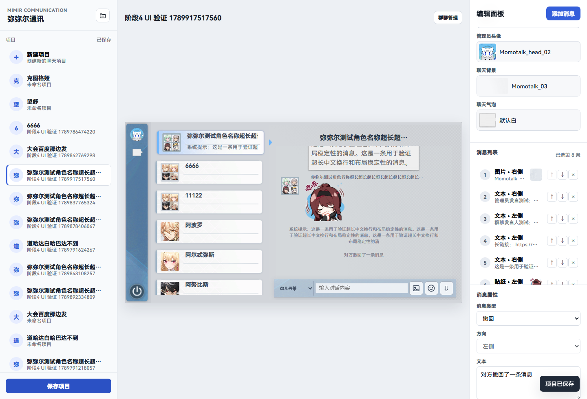
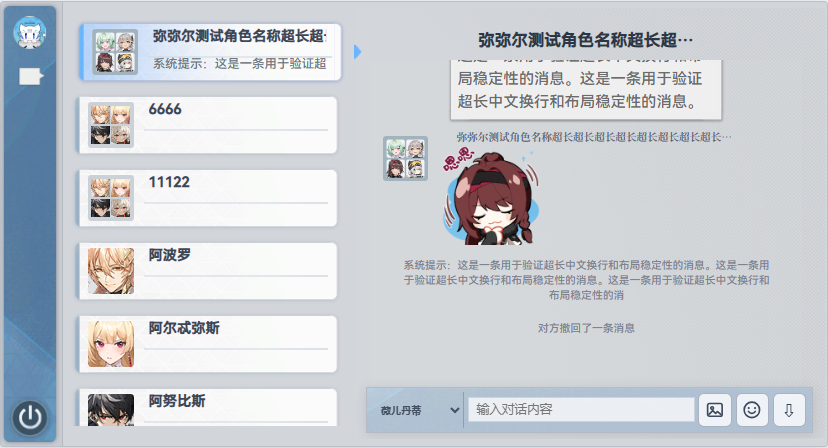
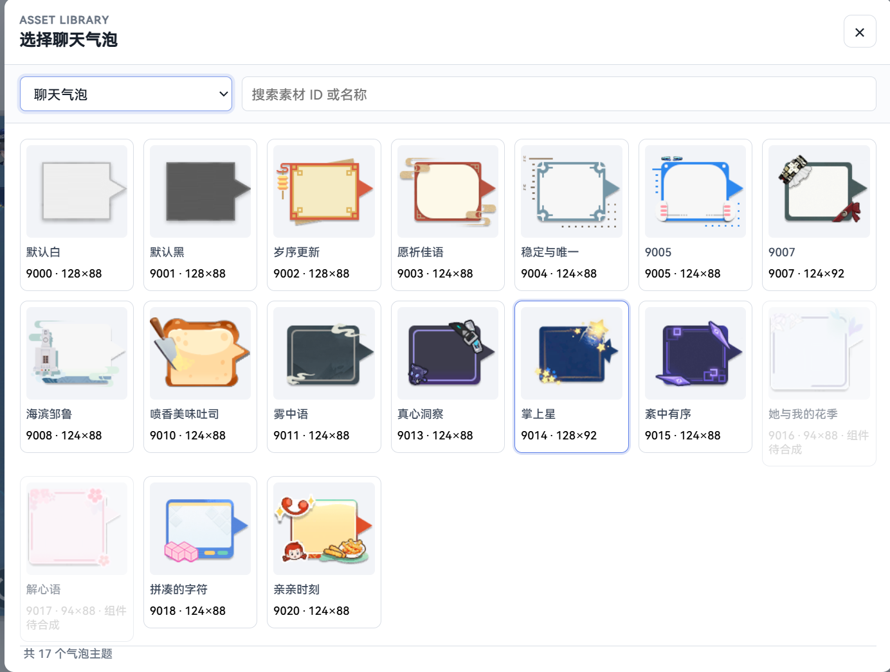
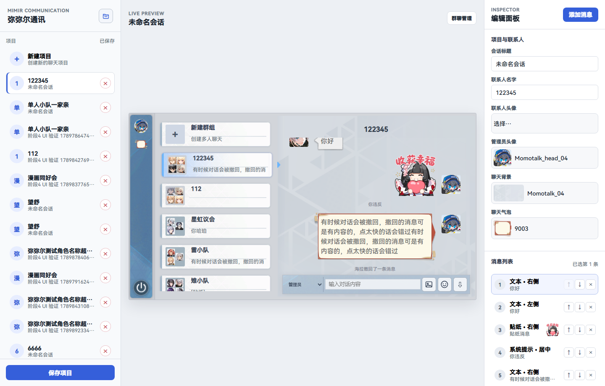
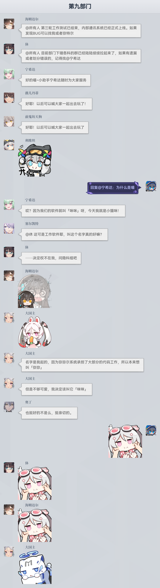

# MimirTalk WebUI

<div align="center">

[](https://github.com/DaydDream/mimirtalk-webui/actions/workflows/ci.yml)
[](https://github.com/DaydDream/mimirtalk-webui/releases/latest)
[](LICENSE)


<br>

<table>
  <tr>
    <td align="center">
      <a href="docs/screenshots/final/最终-编辑器桌面.png"></a><br>
      <sub>编辑器 · 编辑角色对话</sub>
    </td>
    <td align="center">
      <a href="docs/screenshots/final/最终-聊天预览桌面.png"></a><br>
      <sub>聊天预览 · 游戏内效果</sub>
    </td>
  </tr>
  <tr>
    <td align="center" colspan="2">
      <a href="docs/screenshots/final/气泡主题总览.png"></a><br>
      <sub>气泡主题 · 17 组主体</sub>
    </td>
  </tr>
  <tr>
    <td align="center">
      <a href="docs/screenshots/final/项目管理界面.png"></a><br>
      <sub>项目管理 · 本地 JSON 存档</sub>
    </td>
    <td align="center">
      <a href="docs/screenshots/final/长图导出展示.png"></a><br>
      <sub>长图导出 · 一键导出 PNG</sub>
    </td>
  </tr>
</table>

</div>

> 深空之眼（AetherGazer）弥弥尔通讯 / MomoTalk 风格聊天编辑器与长图导出工具

一个**离线可用**的本地 WebUI：编辑角色对话、选择气泡与贴纸、预览游戏内效果，并导出为长图。

## 功能与限制

### 功能

1. **联系人系统**：联系人列表为游戏内可使用的修正者与部分手动加入的角色；群组列表取自游戏内弥弥尔通讯的默认列表，并提供按联系人自由创建、改名、增删成员的群组管理功能
2. **消息类型**：文本、系统提示、撤回、贴纸、图片
3. **贴纸与表情**：官方 31 个分类（其中 29 个可选），共 341 张贴纸
4. **气泡主题**：17 组主体
5. **聊天背景**：仅提取了游戏内两张资源作为聊天背景
6. **长图导出**：一键导出聊天记录为 PNG，单次最多导出 20 个消息栏；超出单图尺寸上限时自动拆分为多张图片
7. **本地存档**：项目以 JSON 保存在本地，自动保存，支持多项目管理
8. **完全离线**：所有素材与字体随包提供，不访问任何外部站点

### 限制与说明

- 本项目的**素材解包、数据处理、前后端开发、测试与打包发布全部由 AI 完成**，未经过人工逐项复核，可能存在未覆盖的边界情况。
- 游戏内的**贴纸 / 表情资源与气泡资源包含动态（序列帧 / 动画）文件**。出于导出为静态长图的可行性考虑，项目**未加载动态功能**，因此这些动态资源未纳入本项目，仅使用其中的静态部分。
- 长图导出受浏览器画布尺寸限制：单张上限为 30000 像素高度，超出时自动降为 1 倍缩放；仍超出则按高度拆分为多张图片。
## 快速开始

### 方式一：使用发布包（推荐普通用户）

从 [Releases](../../releases) 下载最新发布包，解压后双击 `启动WebUI.cmd`。
发布包内置 Python 运行时与 Pillow，**无需安装任何环境**。

浏览器会自动打开 `http://127.0.0.1:8765/`。

### 方式二：从源码运行（开发者）

需要 Python 3.12+。双击 `启动WebUI.cmd` 即可，脚本会自动检查依赖并打开浏览器：

```text
启动WebUI.cmd          # 默认 8765 端口
启动WebUI.cmd 8766     # 指定端口
```

也可以手动运行：

```powershell
pip install -r requirements.txt
python webui/backend/app.py --host 127.0.0.1 --port 8765
```

然后访问 `http://127.0.0.1:8765/`。

> 若在仓库根目录放置 `python-runtime/`（内置运行时），启动器会优先使用它，此时完全不依赖系统 Python。

### 素材目录

仓库出于体积考虑**不包含**解包素材（约 24 MB 的 PNG）。要让界面完整显示，把发布包解压后得到的
`assets_source/` 目录复制到仓库根目录即可，索引中的路径（`assets_source/aethergazer_momotalk/...`）
会自动对应上：

```text
mimirtalk-webui/
├── assets_source/     ← 从 Release 解压得到
├── webui/
└── ...
```

少量手工补充的头像与界面图集（5 个文件）已随仓库提供，位于 `webui/assets/`。

可用下面的命令检查素材引用是否完整：

```powershell
python webui/tools/check_asset_references.py
```

## 目录结构

```text
.
├── webui/                      应用本体
│   ├── backend/                HTTP 服务、素材索引、项目存储
│   ├── frontend/               页面、样式与脚本（含内置字体）
│   ├── assets/                 手工补充头像、图集、界面背景
│   ├── data/                   联系人、气泡主题、贴纸分类、素材索引
│   ├── schema/                 项目 JSON schema
│   └── docs/                   开发说明、需求、交接与审计文档
├── assets_source/              解包素材（从 Release 解压获得，不入库）
├── tools/                      解包与素材处理脚本（不含二进制工具）
├── docs/                       项目文档
│   ├── unpack/                 解包流程
│   ├── guides/                 各专项说明
│   ├── reports/                素材/气泡/联系人审计报告
│   ├── screenshots/            界面与验证截图
│   ├── data-backup/            清理前的数据快照与清单
│   ├── legacy-tools/           一次性历史脚本
│   ├── DEVELOPMENT.md          完整开发日志
│   └── ARCHIVE_MANIFEST.json   归档文件校验清单
└── requirements.txt            运行依赖（仅 Pillow）
```

## 数据与素材来源

- 角色名、图标路径、气泡与贴纸配置均从《深空之眼》客户端解包获得。
- 素材提取流程见 [`docs/unpack/`](docs/unpack/)。
- 运行时只加载 `webui/data/asset_index.json` 中登记的素材，未引用素材已在整理阶段移除。
- 字体：
  - `Source Han Sans`（正文）— SIL Open Font License 1.1
  - `Noto Serif SC`（角色名）— SIL Open Font License 1.1

## 开发说明

- 后端为 Python 标准库 `http.server`，无第三方 Web 框架。
- 前端为原生 HTML / CSS / JavaScript，无构建步骤，直接由后端提供静态文件。
- 素材索引与联系人映射由 `tools/` 下的脚本生成。
- 需求与设计决策记录见 [`webui/docs/`](webui/docs/)。

### 环境说明

发布包内含嵌入式 Python 3.12.10 与 Pillow 12.3.0，但**仓库不包含**：


如需重新生成素材索引，请先按 `docs/unpack/` 完成解包，并把结果放到仓库同级的 `extract/` 目录。

## 免责声明

本项目为粉丝向二次创作工具，与《深空之眼》及其发行商、开发方无任何关联。

游戏相关的名称、角色、图像、音频等素材版权归各自权利人所有，本项目仅用于学习交流，请勿用于商业用途。

## 许可证

- **源代码**：MIT 许可证，详见 [LICENSE](LICENSE)
- **第三方资源**（字体、游戏素材等）：版权归各自权利人所有，
  详见 [THIRD_PARTY_NOTICES.md](THIRD_PARTY_NOTICES.md)
